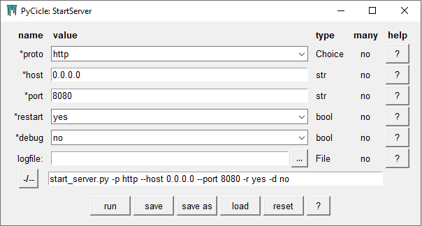
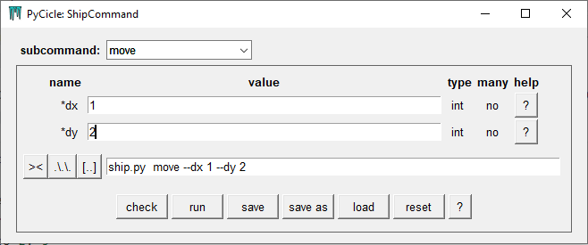
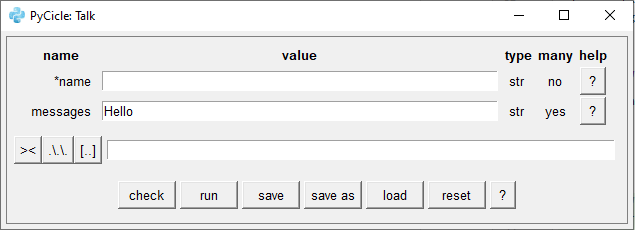

# PyCicle
 A simplified argument parser for starting python programs from the command line. A GUI generator to start the same programs from a window.

## Purpose

This module has 2 main goals:

1. Make the configuration of command line options for your program easy*,
2. Allow users of your script to configure it from a GUI instead of the command line.

*compared to using `argparse` or `optparse` from the python standard library.

## Introduction

Using the well known python `argparse` library has always been somewhat of a chore. It is well known, it works and is stable, but not very intuitive to write and the resulting code is relatively hard to read. 

The first version of PyCicle was actually a thin wrapper around `argparse`, but when trying to implement more complicated command lines, the project stalled a bit ... That is why this project has its own parsing logic and it follows the goals of a good command line interface, but there are some differences from the standard set by  `argparse`: in essence, the parsing logic used in PyCicle is very similar to the logic python itself uses to define and call functions. For example: positional arguments can be used on the command line as long as the parser can figure out how to assign them to the arguments defined in the parser.

## Installation

PyCicle can be easily installed with pip using `pip install pycicle`.

## Example

To start a server you could configure the parser as follows (we will break it down in later sections; to get started, see "Instruction"):

```python
# start_server.py
from pycicle import CmdParser, Argument, File, Choice

def is_valid_host(ip):
    """ roughly """
    parts = list(map(int, ip.split('.')))
    return len(parts) == 4 and all(0 <= p < 256 for p in parts)

def is_valid_port(port):
    return 10 <= int(port) <= 9999

class StartServer(CmdParser):
    """
    these comments will show from the main help (?) button in the GUI and on the command line after --help. 
    """
    proto = Argument(Choice('http', 'https'), default='http', 
                     help='the protocol the server will use')
    host = Argument(str, default='0.0.0.0', valid=is_valid_host, 
                    help='host IP of the server')
    port = Argument(str, default=8080, valid=is_valid_port, 
                    help='port on which the server should run')
    restart = Argument(bool, default=True, 
                       help='should the server restart after exception?')
    logfile = Argument(File('.log'), default=None, 
                       help='logfile for the server, log to stdout if not set')
    debug = Argument(bool, default=False, help='run in debug mode')

if __name__ == '__main__':
    def start_the_server(proto, host, port, restart, debug, logfile=None):
        """ place holder function, could also start a real server; called from the parser """
        print(f"starting server: {proto}://{host}:{port} restart: {restart}, debug: {debug}, logfile: {logfile}")

    StartServer(start_the_server)()

```

Running this file from the command line with arguments in the usual style, e.g. `> python start_server.py -p 80`)  will work as usual: it will call `start_server` with the provided/default arguments. Calling  `> python start_server.py --gui` however opens up a window:




Allowing the user to configure the server with help and validation, run the server or copy the resulting command line to a command prompt. 

## Features

PyCicle provides the following features:

- The ability to create a command line interface as a class with class attributes (descriptors), including:

  - *Validation*; type checking as well as custom validation are supported,
  - *Defaults*; if a default is configured for an argument, the argument can be omitted on the command line, conversely, if no default is configured, the arguments is required,
  - *Multiple values* for an argument; these will be parsed and result in a list of parsed values,
  - *Positional* arguments; as long as the parser can find the argument to assign the values to, flags can be omitted,
  - *Switches*; if the argument is of boolean type and the default is False, its flag can be omitted on the command line (meaning False) or be present without a value (meaning True),
  - *Subcommands*; a command line can be extended with subcommands; like `python server.py start -h 0.0.0.0 -p 5050`, where 'start' is the subcommand,
  - *Help*: a `help` text can be added to each argument and the doc-string of the parser class will be shown in the GUI or for the `--help` flag on the command line.

- From the definition of a command line interface, a GUI can be auto generated (for free, without any extra configuration), including:

  - A form (or forms) where the values for the command line can be set, with automatic validation,
  - The ability to start the underlying program with the configuration set in the form,
  - The ability to show (in different formats), save and load the command line,
  - The ability to select and set the configuration for different subcommands,
  - Help buttons for the command line as a whole as well as the individual arguments, partly auto-generated text, partly set by the developer of the interface in the parser configuration.

- Some extras are also available, like:

  - Running the command line as an interactive prompt, for example using subcommands to call different functions in a single python session,
- Creating a command line parser directly from an annotated function definition, e.g. `CmdParser.from_callable(func)` (see "Configuration/Creating a Parser from a Function").

## Instruction

In general the following steps can be followed to create a command line interface (with associated GUI):

1. Create a target function (or multiple functions when using sub-parsers), for example:

   ```python
   # sayit.py
   def say_it(name, texts):
       start = '\n\t'  # cannot use '\' in f-strings
       print(f"{name} says: {start}{start.join(texts)}")
   ```

2. Create the associated command parser class:

    ```python
    from pycicle import CmdParser, Argument
    
    class Sayer(CmdParser):
        """
        This is the command line parser for the function 'say_it()'
        """
        name = Argument(str, default='Bob', help='this is the person saying something')
        texts = Argument(str, many=True, default=['nothing'], help='this is what is said')
    ```

3. Create an instance of the parser and assign the target function to it:

    ```python
    sayer = Sayer(say_it)
    ```

4. Just in case, let's test the parser. This can be done by replacing the target function with an assertion function. With unittest:

   ```python
   import unittest
   from sayit import Sayer
   
   class TestSayer(unittest.TestCase):
       def test_basics(self):
           expected = {'name': 'Ann', 'texts': ['Hello', 'Goodbye']}
           
           def asserter(**kwargs):  # assertion function
               self.assertEqual(kwargs, expected)
               
           sayer = Sayer(asserter)
           sayer.parse("Ann Hello Goodbye", run=True)
           sayer.parse("-n Ann -t Hello Goodbye", run=True)
           sayer.parse("--name Ann --texts Hello Goodbye", run=True)  # etcetera 
   ```

   Note that this is only testing the parser, not the target function `say_it()`. 

5. Use the parser; there are a few ways you can put it to work:

   - Run as normal; prepare the parser to be called from the command line:

     ```python
     if __name__ == '__main__':
         sayer = Sayer(say_it)
         sayer.cmd()
         # or just: Sayer(say_it).cmd()
     ```

     and run from command line:

     ```
     > python sayit.py Ann --texts Hello ByeBye  # or
     > python sayit.py Ann -t Hello ByeBye  # etc
     ```

     which both print:

     ```
     Ann says: 
     	Hello
     	Goodbye
     ```

   - Run the GUI; this can be done in 2 ways, from the python script:

     ```python
     if __name__ == '__main__':
         Sayer(say_it).gui()
     ```

     or from the command line: run with `.cmd()` and on the command line type: `> python sayit.py --gui`.

6. An example of using sub-parsers can be found below in "Configuration/Configuring Subparsers". An example of auto-generation of a parser from a function can be found above in "Configuration/Creating a Parser from a Function".

## Using the GUI

When the GUI is started, a window as seen above opens. Most buttons and other widgets have tooltips describing their function. Please refer to the GUI itself for more info. One note though:

Running the target function from the GUI starts it up in a new thread (which ends when the function ends or when you close the output window). This is necessary to keep the GUI responsive when running a function that takes a while to finish. If you want to run a target function that should keep running after you close the GUI (like starting up a server), you could create a non-daemon process within the target function itself, or you can copy-paste the command from the GUI to the CLI of your choice.

## Configuration

To configure the command line options (and corresponding GUI) an object oriented approach is used. When creating a new parser, you inherit from the base class `CmdParser` and define arguments with the descriptor `Argument` (more about descriptors [here](https://docs.python.org/3/howto/descriptor.html#descriptor-protocol)):

```python
# prog.py
from pycicle import CmdParser, Argument

def target_func(arg):
    print(f"arg is {arg}")

class MyParser(CmdParser):
    arg = Argument(int, help='my new command line argument')
    
parser = MyParser(target_func).cmd()
```

From the command line the underlying program can be run with:

```
> python prog.py --arg 3
```

or with a short flag: 

```
> python prog.py -a 3
```

or with a positional argument (positional arguments are very much handled like positional arguments in python functions):

```
> python prog.py 3
```

The easiest way to define the script to be started this way is to initialize the parser with a target:

```python
def printer(arg):
    print(arg)
    
parser = MyParser(printer)
```

#### Configuring Arguments

Arguments can be configured with a number of options. Only `type` is required:

- `type`: The type of the argument as used by the target. This can be `int, str, bool, float, datetime, date, time, timedelta`, but there are a few more (described below) and it is possible to create your own types,
- `flags` (default=None): override the default flags; the default flags are `--[argument_name]` and `-[argument_name[0]]`,  so argument 'host' would have flags `--host` and `-h`,
- `many` (default=False): whether one or more values are expected, so:
  - `many=False` means there is a single value expected,
  - `many=True` means that any number of values is expected. They will be turned into a list,
  - Note: if `many=True` the `type` option above applies to the individual elements of the list,
- `default` (default=MISSING): a default value for the argument. It must be of type `type` or `None`. This value will be used if no value is given on the command line, MISSING means the argument is required on the command line,
- `valid` (default = None): an optional validator function (returning True or False) for the argument value, allowing extra validation over the the typecheck based on `type`.  `None` (the default) , means no extra validation will take place,
- `help`: (default=""): a help string that will be shown when the user types `> python somefile.py --help`) and is show in the GUI via the `? ` buttons.

Most inconsistencies between arguments will raise an exception, but some are impossible to track, like a `valid` function conflicting with the type. This will raise an exception when running the script itself though.

A fully configured Argument could look like this:

```python
class MyParser(CmdParser):
    some_arg = Argument(int, flags=('-a', '--arg'), many=True, default=[1, 2], valid=lambda v: len(v) == 2,
                           help='this is a pretty random argument')
```

#### Initializing the Parser

The parser constructor has one main argument and it is intended to be positional (to avoid name conflicts; see subparsers later on):

- `__target` (callable, default=None): the user callable to be called with the argument values set on the command line or in the GUI. Note that the target function parameters must be the same as the command line options! When no target is given, arguments are parsed (validated), but there is no target to run. Example:  `parser = Parser(some_target)`,

- `**subparsers`: additionally sub-parsers can be configured. These correspond to sub command on the command line. For example:

  ```python
  parser = MainParser(a_target,
                      init=InitParser(some_target),
                      run=RunParser(some_other_target))
  ```

  which from the command line would be called as `python file.py --name Bob` , `python file.py init --rank 3` or `python file.py run --time 30` (but with appropriate arguments).

Note that both a target and sub-parsers can be configured. More on sub-parsers below. 

#### Running the Parser

The are a couple of ways to run the parser (using `parser = Parser(some_target)` as example):

- `parser.cmd()`:  this can be called in a python file that will be run from the command line. The arguments to be parsed will be read from the command line (e.g. `> python start_server.py http 0.0.0.0 --port 8080`),
- `parser.gui()`: this will open the GUI when called. The GUI can be used to set the arguments and optionally run the program,
- `parser.parse(*cmds)`: can be used to specify individual command line arguments (usually in tests): for example `parser.parse('1', '2', '--text hello')`,
- `parser(cmd=None)`: A shortcut using the `Parser.__call__` method. If no arguments are given, this will run as `cmd()` above, otherwise it will parse the `cmd` and run the target (if a target is configured),
- To run the GUI from the command line, run `parser.cmd()` and argument `--gui`,  e.g.: `> python start_server.py --gui`,
- `parser.prompt()` will start prompt and an evaluation loop taking arguments from the command line, parsing them and executing a target function. This can be useful in combination with subparsers. 

#### Types and Codecs

Since the command line only takes as argument values, the parser must be able to decode/parse the values to their actual type (the `type` parameter in Argument). To be able to run the GUI and generate different options for the command line these values must be encoded back to strings. 

This is supported out-of-the-box by PyCicle for a number of types:

- `str`, `int`, `float` or `bool` and their subclasses,
- `date`, `time`, `datetime`, `timedelta` from the standard python `datetime` module,
- `Choice`, `File` and `Folder`, implemented as subclasses of basic types in `custom_types.py`*.

Additionally types can be added to work with PyCicle in 2 ways:

1. Adding a type with encode and decode function to (your subclass of) `CmdParser`: for this the `@classmethod` `set_codec()` can be used as in:

   ```python
   CmdParser.set_codec(mytype, encode=myencoder, decode=mydecoder)
   ```

   with:

   - `mytype` the type you want to support, used when you define an argument (`some_name = Argument(mytype)`),
   - `myencoder` a function that take a value of `mytype` and returns a string (`str`),
   - `mydecoder` a function that takes a string and return a value of `mytype`,
   - Note: `mytype` must support `isinstance(some_value, mytype)`.

2. Creating you own type. These types do not have to be added to the parser. It must have:

   - an `__init__` method that supports a single string argument,
   - a `__str__` method that return the string representation of a value of your type, that can be used by `__init__` as argument to recreate the value, similar to how `int("3") == 3` and `str(3) == "3"`,

Note that instead of adding or creating your own types, your target function could do some conversions as well.

#### *Choice, File and Folder

As mentioned above there are a couple of custom types (factories) already defined to be used in the parser:

- `Choice(*choices)`: this type is comparable to an Enum. It can be configured with `float`, `int` and `str` values, but not mixed types. For example `Argument(Choice('green', 'red', 'blue'), default='green')` or `Choice(1, 2, 3)`,
- `Folder(existing=None)`: represents a folder in the file system. It is a subclass of `str`. `existing=True` means the folder must exist, `False`: the folder must not exist  and `None` (default): don't care. Example: `Folder(existing=True)`,
- `File(*extensions, existing=None)`: represents a file in the file system. With `existing` as in `Folder` and `*extensions` the extensions, that are allowed to be configured (no extensions means all extensions). Example: `File('.log', existing=False)`. 

Note that `Choice`, `Folder` and `File`are actually class factory functions; they are handled somewhat differently than user-created types (mainly because they are configurable, and have custom widgets in the GUI). The base classes are `ChoiceBase`, `FolderBase` and `FileBase` respectively (in case you want use `isinstance`/`issubclass`).

#### Configuring Subparsers

Subparsers are parsers that can be called with an extra first argument on the command line. Both a main parser and subparsers can be used. An example:

```python
# ship.py
from pycicle import CmdParser, Argument

class Ship:
    def __init__(self, name):
        self.name = name
        self.x = 0
        self.y = 0
        self.sunk = False
        print(f"'{self.name}' was created")

    def move(self, dx, dy):
        if self.sunk:
            print(f"'{self.name}' sank, no more moving around")
        else:
            self.x += dx
            self.y += dy
            print(f"'{self.name}' moved to {self.x}, {self.y}")

    def sink(self, sunk):
        self.sunk = sunk
        print(f"'{self.name}' {'sank' if sunk else 'unsank'}")

    def __str__(self):
        if self.sunk:
            return f"'{self.name}'(sunk at {self.x}, {self.y})"
        return f"'{self.name}'({self.x}, {self.y})"

class Move(CmdParser):
    dx = Argument(int)
    dy = Argument(int)

class Sink(CmdParser):
    sunk = Argument(bool, default=True)

class Quit(CmdParser):
    # no arguments: quit is quit
    def __init__(self):
        super().__init__(self.quit)

    def quit(self):
        raise KeyboardInterrupt

class ShipCommand(CmdParser):
    name = Argument(str)

    def __init__(self):
        super().__init__(self.create,
                         move=Move(self.move),
                         sink=Sink(self.sink),
                         quit=Quit())
        self.ship = None

    def create(self, name):
        self.ship = Ship(name)

    def move(self, dx, dy):
        self.ship.move(dx, dy)

    def sink(self, sunk):
        self.ship.sink(sunk)

if __name__ == '__main__':
    ship_command = ShipCommand()
    ship_command.prompt()
```

Note that how in `ShipCommand.__init__` the sub-parsers are added to the main parser and that the sub-parsers classes are also subclasses of `CmdParser`, meaning that sub_parsers can have sub-sub-parsers, and so on.

Apart from usage on a normal command line, sub-parsers can also be handy for interactive sessions. These can be started with a call to `parser.prompt()` as seen above. This would result in a session like:

```bash
$ python ship.py  #start the session
ship> "Queen Mary"  # or --name "Queen Mary"
'Queen Mary' was created
ship> move 2 3  # or move --dx 2 --dy 3
'Queen Mary' moved to 2, 3
ship> move -1 1
'Queen Mary' moved to 1, 4
ship> sink
'Queen Mary' sank
ship> quit

Process finished with exit code 0
```

Using the prompt keeps the python session running, so you can keep all data in memory and available between prompt commands (as seen above).

When a sub-parser is configured, the GUI will give the option to select the sub-parser (subcommand) to configure and run:





#### Creating a Parser from a Function

It is possible to create a command line parser directly from a function. This option has some limitations, since not all argument parameters, like a custom validator, can be derived from the function signature. However for a quick command line definition, this can be useful.

Example, from the function `talk()` below, the command line parser can be created with `CmdParser.from_callable(talk)` and be invoked with either `.cmd()`, `.gui()` or `.parse(cmd, run=False)` as always:

```python
# talk.py
from pycicle import CmdParser

def talk(name: str, messages: list[str] = ['Hello']):
    for message in messages:
        print(f"{name} says '{message}'")

CmdParser.from_callable(talk).cmd()        
```

with `> python talk.py --gui` shows:



or it could be called with e.g. `> python talk.py Bob -m Hello Goodbye`. 

Limitations are:

- The type annotation must either be a basic type (`str`, `int`, `float` or `bool`) or a subclass thereof (like `Choice`, `File` or `Folder`) or be a `List` (from the standard module `typing`) of these types (like `List[int]`), alternatively you can add or define you own types (see above), but that reduces the ease-of-use factor somewhat,
- Only `type`, `many` and `default` can be derived for Argument definition (not `flags`, `valid` and `help`); `many` is set to True if the type annotation is a `List[]` with some element type.

## Parser Logic

Given a parser configuration, some rules are applied to the actual command line:

1. Flags (like `--host` or `-h`) and values must be separated by spaces (' '),
2. Positional arguments on the command line are interpreted in the order the arguments are defined, 
3. All positional arguments must be placed before all arguments with flags on the command line; the order of flagged arguments does not matter,
4. Positional arguments on the command line can (don't have to) be used until the second argument with multiple values (`many=True`), after that the parser cannot determine which value to assign to which argument and the parser will raise an Exception. This corresponds to the logic of python function definitions,
5. Boolean arguments (`type=bool`) with default False (`default=False`) can be used without value; if the flag is present the parser interprets this as True, otherwise it is interpreted as False. If you want the flag to mean other values, this translation must be done in the target function, 
6. If you want strings with spaces on the command line to be handled as single strings, put them between double quotes, like `"Hello, Goodbye"`,
7. `gui` and `help` are reserved names and cannot be used as argument names, neither can arguments names start with an underscore '_' (`--gui` is used to start the GUI and `--help` is used to show argument help from the command line). 

## Contributions

Any contributions, comments, issues, pull requests etc., also about the readme, are very welcome!
