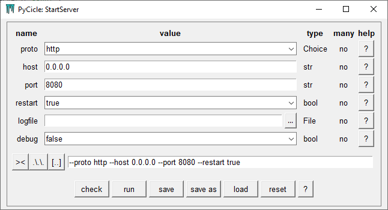

# PyCicle
 A simplified argument parser for starting python programs from the command line. A GUI generator to start the same program from a Window.

## Purpose

This module has 2 main purposes:

1. Simplify the configuration of command line options for your program*,
2. Let users of your script start the program from a auto-generated GUI instead of the command line.

*compared to using `argparse` or `optparse` from the standard library.

## Installation

PyCicle can be easily installed with pip using `pip install pycicle`.

## Example

To start a server you could configure the parser as follows:

```python
# file: start_server.py (in this example)
from somewhere import Server  # e.g. some webserver
from pycicle import CmdParser, Argument, File, Choice


def is_valid_host(ip):
    """ roughly """
    parts = list(map(int, ip.split('.')))
    return all(0 <= p < 256 for p in parts)


def is_valid_port(port):
    return 10 <= int(port) <= 9999


class StartServer(CmdParser):
    """
    This is the help text for the GUI. It shows when pressing the '?' button at the bottom.
    """
    proto = Argument(Choice('http', 'https'), required=True, default='http',
                     help='the protocol the server will use')
    host = Argument(str, required=True, default='0.0.0.0', valid=is_valid_host,
                    help='host IP of the server')
    port = Argument(str, required=True, valid=is_valid_port, default=8080,
                    help='port on which the server will run')
    restart = Argument(bool, default=True, required=True,
                       help='should the server restart after interruptions?')
    debug = Argument(bool, default=False, required=False,
                     help='run the server in debug mode')
    logfile = Argument(File('.log'), required=False, default=None,
                       help='logfile for the server, log to stdout if none')


if __name__ == '__main__':
    def start_server(proto, host, port, restart, debug, logfile=None):
        Server(proto=proto, host=host, port=port).run_forever(restart=restart, debug=debug, log=logfile)


    StartServer(target=start_server)
```

Running this file from the command line with arguments in the usual style, e.g. `> python start_server.py -p 80`)  will work as normal: it will call `start_server` with the provided arguments. Just calling  `> python start_server.py` however opens up a window:




Allowing the user to configure the server with help and validation, run the server or copy the resulting command line to a command prompt. 

## Configuration

To configure the command line options (and corresponding GUI) an object oriented approach is used. When creating a new parser, you inherit from the base class `CmdParser` and define arguments with the descriptor `Argument` (more about descriptors [here](https://docs.python.org/3/howto/descriptor.html#descriptor-protocol)):

```python
# prog.py
from pycicle import CmdParser, Argument


class MyParser(CmdParser):
    arg = Argument(int, help='my new command line argument')
```

From the command line the underlying program can be run with:

```
> python prog.py --arg 3
```

or 

```
> python prog.py -a 3
```


The easiest way to define the script to be started this way is to initialize the parser with a target:

```python
def printer(arg):
    print(arg)
    
parser = MyParser(target=printer)  # use the keyword 'target'
```


#### Configuring Arguments

Arguments can be configured with a number of options. Only `type` is required:

- `type`: The type of the argument as used by the target. This can be `int, str, bool, float, datetime, date, time, timedelta`, but there are a few more (described below) and it is possible to create your own types,
- `many` (default=False): whether one, a specific number or any number of values are expected, so:
  - `many=False` means there is a single value expected,
  - `many=True` means that any number of values is expected. They will be turned into a list,
  - Note: the `type` option above applies to the individual elements of the list,
- `default` (default=MISSING): a default value for the argument. It must be of type `type` or `None`. This value will be used if no other value is given on the command line,
- `valid` (default = None): an optional validator function for the argument value, allowing extra validation over the the typecheck based on `type`. A `None` value will not be validated,
- `help`: (default=""): last but not least, a help string that will be shown when the user types `> python somefile.py -h` (or `--help`) and is show in the GUI via the `? ` buttons.

Most inconsistencies between arguments will raise an exception, but some are impossible to track, like a `valid` function conflicting with the type. This will raise an exception when running the script itself though.

A fully configured Argument could look like this (but the defaults should keep most configurations shorter ;-):

```python
class MyParser(CmdParser):
    my_argument = Argument(int, required=True, many=True, default=[1, 2, 3], novalue=[1, 1, 1],
                           positional=False,  valid=lambda v: v[0] == 1, callback=lambda v, ns: print(ns),
                           help='this is a pretty random argument')
```


#### Initializing the Parser

The parser constructor has three arguments:

- `cmd_line` (str, default=""): the cmommand line to be parsed, `cmd_line` will be explained below,
- `target` (callable, default=None): the user callable to be called with the argument values when the parser is done, or when the 'run' button in the GUI is clicked. When there is no target, arguments are parsed (validated), but nothin is run,

The parser can get arguments in 2 ways: from the command line and in the python file where it is initialized. When the parser is initialized in the python file, there are 4 ways:

1. With `args` is None (e.g. `parser = MyParser(target=my_target)`): In this case there are 2 options for the command line:
   - With command line options (e.g. `> python start_server.py --host 10.0.0.127 --port 8080`) the parser will validate and run the target with the argument values, 
   - Without command line options (e.g. `> python start_server.py`) the GUI will be started (unless `use_gui` is set to False, then it will try to validate and run with the default values),
2. With `args`  being the command line arguments, as either a string or a list of strings. This will validate and run the target (if given) with these options. Examples:
   - As string in the python file: `MyParser('--host 10.0.0.127 --port 8080')`, same as:

Option 1 is intended for normal use. 2 and 3 are more for testing purposes.

